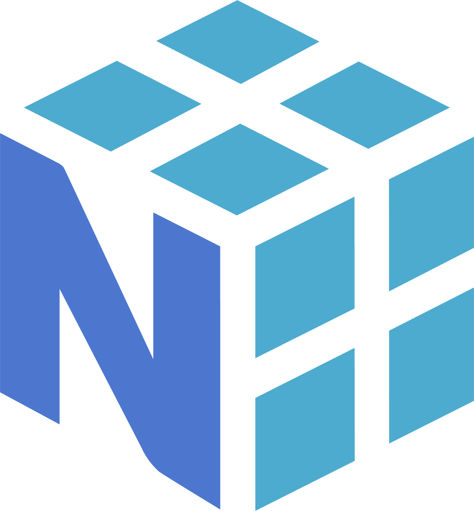
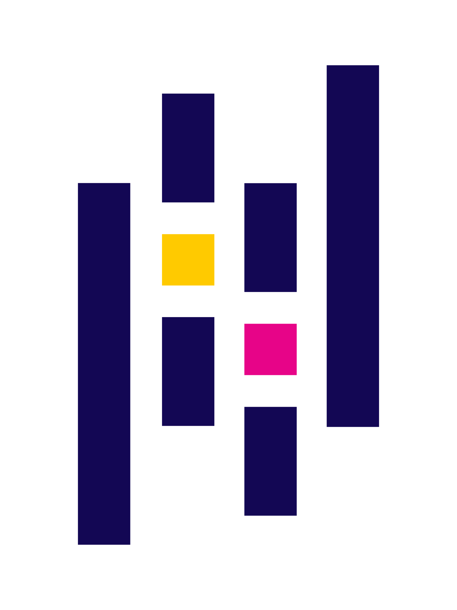
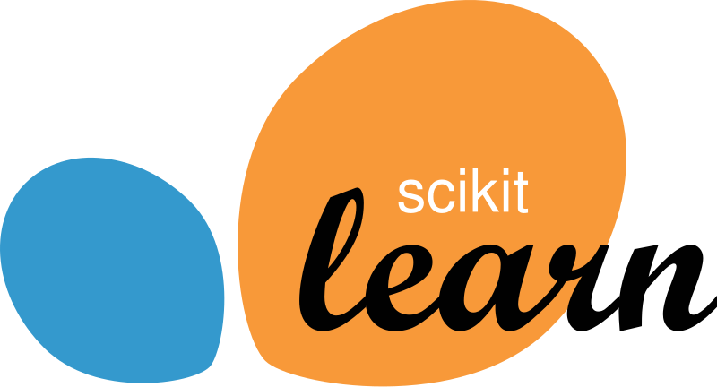
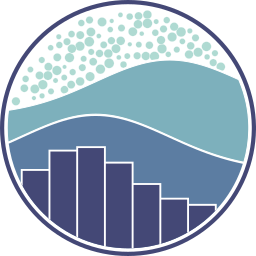

<h1 align="center">Hi 👋, I'm Kauã Lima</h1>
<h3 align="center">A developer with a passion for mathematics, AI and technology</h3>

------

```python
class Me:
    def __init__(self):
        self.name = "Kauã Lima"
        self.age = 18
        self.nationality = "Brazilian"
        self.gender = "Male"
        self.pronouns = "He/Him"
        self.email = "kaualimadev@gmail.com"
        self.birthday = "July 29th"
```
----

<h3 align="center">Languages</h3>
<div align="center" style="display: flex; flex-wrap: wrap; justify-content: center; align-items: center; gap: 10px;">
<code style="padding: 5px 5px 0 5px;"></code>
<code style="padding: 5px 5px 0 5px;"></code>
<code style="padding: 5px 5px 0 5px;"></code>
<code style="padding: 5px 5px 0 5px;"></code>
<code style="padding: 5px 5px 0 5px;"></code>
<code style="padding: 5px 5px 0 5px;"></code>
<code style="padding: 5px 5px 0 5px;"></code>
<code style="padding: 5px 5px 0 5px;"></code>
<code style="padding: 5px 5px 0 5px;"></code>
<code style="padding: 5px 5px 0 5px;"></code>
<code style="padding: 5px 5px 0 5px;"></code>
<code style="padding: 5px 5px 0 5px;"></code>
<code style="padding: 5px 5px 0 5px;"></code>
<code style="padding: 5px 5px 0 5px;"></code>
<code style="padding: 5px 5px 0 5px;"></code>
</div>
<br>

----

<table>
    <tr>
        <td align="center">
            
        </td>
        <td align="center">
            
        </td>
        <td align="center">
            
        </td>
    </tr>
</table>

----
<h3 align="center">Contact Me</h3>
<div align="center">

[](https://kaualima-portfolio.vercel.app/)
[](https://www.linkedin.com/in/kaua-lima/)
[](https://www.kaggle.com/kaualimadev)
[](https://www.instagram.com/kaualimaa.dev/)
[](https://x.com/kaualimaadev)
[](mailto:kaualimadev@gmail.com)
[](https://www.youtube.com/channel/UCrjwgVR-_e4tFPhOutC9F9A)
[](https://open.spotify.com/user/r41lge9dobl6x7smg65d4o5fr)

</div>
